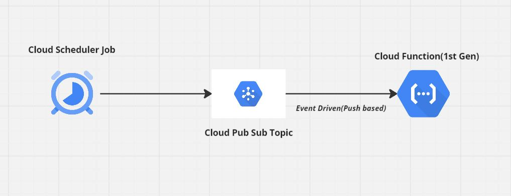

# serverless-on-gcp
This repo Demonstrates Deploying code on GCP Serverless Platform called Cloud Function(1st Gen) to achieve certain stateless Task.

### Pre-Requisites:

- Terraform on your local system to build required Infra.

-  Below GCP API's Enabled:
   - Cloud Scheduler API
   - Cloud Pub/Sub API
   - Serverless VPC Access API
   - Cloud Functions API
   - Cloud Build API
   - Secret Manager API
   - Security Token Service API

### Security Best Practice: 

- Github Actions (used as a CI/CD tool for Infra Deployment) needs to use GCP WIF Authentication to communicate with GCP resources. 
Reference [GCP WIF](https://dev.to/iamgauravpande/enabling-workload-identity-federation-for-github-actions-on-gcp-h8g) 

- Google Secret Manager Service should be used to store any secrets/passwords used by Cloud Function code and to be imported as  Secret Environment Variables.

### GCP Serverless Conceptual Diagram:

